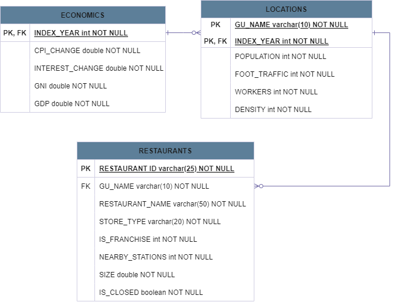

# PJT_-SeoulFoodService
서울시 식품접객업소의 폐업 확률예측을 위한 데이터셋 구축.

---

## 1. 프로젝트 개요

### 1.1. 프로젝트 소개

- 프로젝트 기간 : 2022.07.28 ~ 2022.08.16
- 프로젝트 팀 
  - 팀장 : 고유정
  - 팀원 : 곽성재, 김석호, 윤지원, 최유진
- 프로젝트 목표 및 대상
  - 목표 대상 : 폐업을 고려중인 기존 식품접객업 자영업
  - 코로나의 영향으로 경제적 어려움을 겪는 기존 사업자가 사업 지속 가능성을 판단할 수 있는 근거를 제공
    - 물가, 금리, 지역차이, 임대료 등을 통해 폐업률을 예측하고 영업의 지속여부를 결정에 도움
- 수행도구 
  - 데이터 적재 : Hadoop, MySQL, MongoDB
  - 데이터 처리 : Spark
  - 파이프라인 관리 : Airflow

### 1.2. 파이프라인 설계

- Hadoop : 원본 데이터 저장소, Spark를 이용한 데이터 처리를 위해 사용함.
- MongoDB : GeoJson data를 이용하기 위해 사용함.
- MySQL : 가공된 데이터 저장소.

## 2. 프로세싱

### 2.1.  데이터 수집 및 적재

- **데이터 명세서** 

  

- **데이터 정의(ERD)**

  

### 2.2. 데이터 처리

### 2.3. 데이터 관리

## 3. 기대효과

- 현재 자영업자의 음식사업 아이템의 경쟁력 확인.
  - 자영업자의 의사결정 지원을 통한 비용 절감.
  - 지역별 사업 주요 변수 확인 가능.
- 예비 창업자 객관적인 모의평가를 통해 지역 시장 진입 전 상권 분석 가능.

## 4. 개발후기

- 수업 시간에 배운 데이터 가공 과정을 프로젝트를 통해 본격적으로 적용했다는 점에서 의미 있는 시간이었음.
  - 프로젝트 진행과정 중 팀원들과의 협동을 통해 오류를 해결해나가면서 성장하게 되었음.
- 이전 프로젝트(blueshelter)와 달리 대량의 데이터를 다뤄보면서 데이터 엔지니어가 무엇을 하는지 이해할 수 있는 시간이었음.
